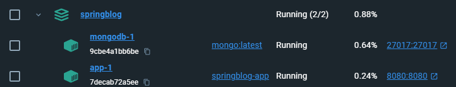

# Spring API com Mongodb

Aplicação para fins de aprendizagem.

## 🚀 Começando

O projeto consiste em uma API CRUD simples e com persistência no banco de dados NoSQL MongoDB.


### 📋 Pré-requisitos

Para conseguir executar o projeto, precisamos executar o docker-compose.yml que irá criar os containers tanto do Mongodb quanto da aplicação.

```
* Docker
* Postman
* PgAdmin (Opcional) 
```

### 🔧 Instalação

Para conseguir executar o projeto, precisamos executar o docker-compose.yml que irá criar os containers tanto do Mongodb quanto da aplicação.
</br> </br> 
Este comando irá criar os containers tanto para o Mongodb quanto para a aplicação. 
```
docker-compose up --build
```
Abaixo um exemplo de como ficariam os containers rodando.



# README ainda em construção...


## ⚙️ Executando os testes

OK. Agora que já temos os containers em execução, precisamos utilizá-los!
Vamos então importar a collection no Postman para que possamos chamar a API.

### 🔩 Importando a Collection no Postman

Explique que eles verificam esses testes e porquê.

```
Dar exemplos
```

### ⌨️ E testes de estilo de codificação

Explique que eles verificam esses testes e porquê.

```
Dar exemplos
```

## 📦 Implantação

Adicione notas adicionais sobre como implantar isso em um sistema ativo

## 🛠️ Construído com

Mencione as ferramentas que você usou para criar seu projeto

* [Dropwizard](http://www.dropwizard.io/1.0.2/docs/) - O framework web usado
* [Maven](https://maven.apache.org/) - Gerente de Dependência
* [ROME](https://rometools.github.io/rome/) - Usada para gerar RSS

## 🖇️ Colaborando

Por favor, leia o [COLABORACAO.md](https://gist.github.com/usuario/linkParaInfoSobreContribuicoes) para obter detalhes sobre o nosso código de conduta e o processo para nos enviar pedidos de solicitação.

## 📌 Versão

Nós usamos [SemVer](http://semver.org/) para controle de versão. Para as versões disponíveis, observe as [tags neste repositório](https://github.com/suas/tags/do/projeto).

## ✒️ Autores

Mencione todos aqueles que ajudaram a levantar o projeto desde o seu início

* **Um desenvolvedor** - *Trabalho Inicial* - [umdesenvolvedor](https://github.com/linkParaPerfil)
* **Fulano De Tal** - *Documentação* - [fulanodetal](https://github.com/linkParaPerfil)

Você também pode ver a lista de todos os [colaboradores](https://github.com/usuario/projeto/colaboradores) que participaram deste projeto.

## 📄 Licença

Este projeto está sob a licença (sua licença) - veja o arquivo [LICENSE.md](https://github.com/usuario/projeto/licenca) para detalhes.

## 🎁 Expressões de gratidão

* Conte a outras pessoas sobre este projeto 📢;
* Convide alguém da equipe para uma cerveja 🍺;
* Um agradecimento publicamente 🫂;
* etc.


---
por: Tiago Kiritschenko Maffi